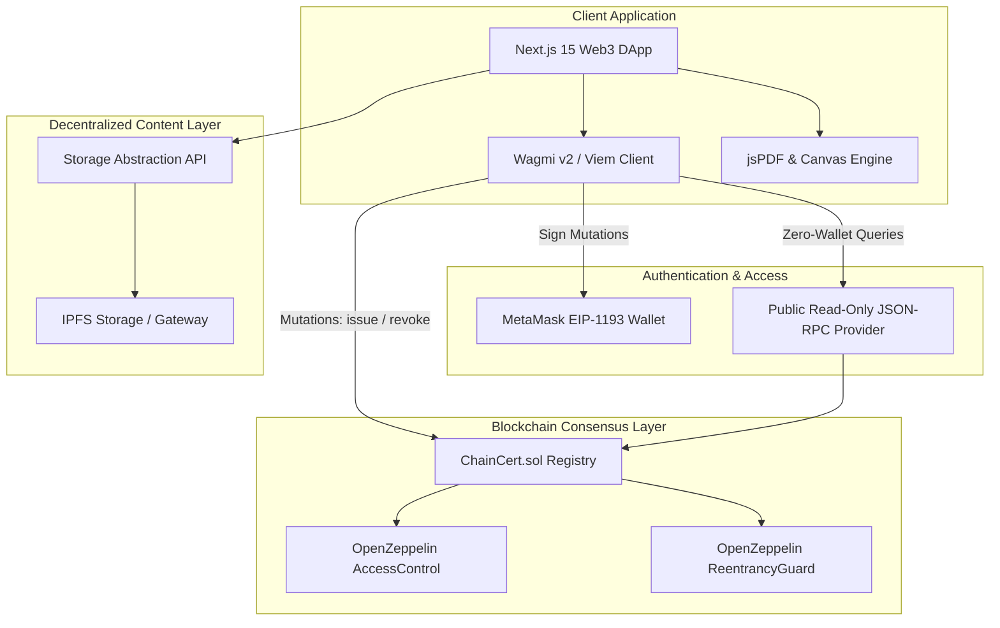
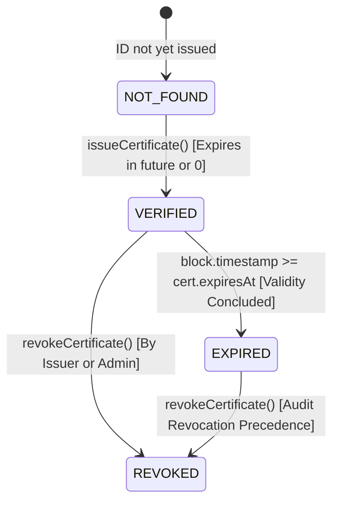
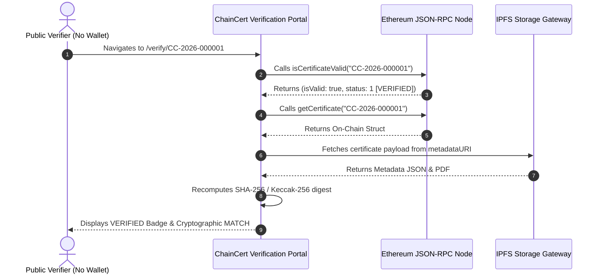

# ChainCert — Decentralized Credential Issuance & Instant Verification Platform

> **Final Capstone Project for 6-Month Intensive Blockchain & Web3 Engineering Course**  
> **Engineering Authors:** Khaleeq ur Rahman & Shahab  
> **Network Status:** Actively running on **Local EVM Hardhat Node** (Chain ID: `31337`, Contract: `0x5FbDB2315678afecb367f032d93F642f64180aa3`) with **Ethereum Sepolia Testnet** configuration support (Chain ID: `11155111`).

---

## Table of Contents
1. [Project Overview](#1-project-overview)
2. [Problem Statement](#2-problem-statement)
3. [Solution](#3-solution)
4. [Features](#4-features)
5. [User Roles & Permissions](#5-user-roles--permissions)
6. [System Architecture](#6-system-architecture)
7. [Technology Stack](#7-technology-stack)
8. [Smart Contract Architecture](#8-smart-contract-architecture)
9. [Certificate Data Model](#9-certificate-data-model)
10. [Certificate Lifecycle](#10-certificate-lifecycle)
11. [Blockchain Architecture](#11-blockchain-architecture)
12. [IPFS & Decentralized Storage Architecture](#12-ipfs--decentralized-storage-architecture)
13. [Wallet & Transaction Architecture](#13-wallet--transaction-architecture)
14. [Public Verification Process](#14-public-verification-process)
15. [Revocation Process](#15-revocation-process)
16. [Security Model & Threat Mitigations](#16-security-model--threat-mitigations)
17. [Local Installation (Clean Clone Guide)](#17-local-installation-clean-clone-guide)
18. [Environment Variables](#18-environment-variables)
19. [Smart Contract Deployment](#19-smart-contract-deployment)
20. [Frontend Configuration](#20-frontend-configuration)
21. [IPFS Configuration](#21-ipfs-configuration)
22. [Testing Suites & Quality Gates](#22-testing-suites--quality-gates)
23. [Testnet Deployment (Ethereum Sepolia)](#23-testnet-deployment-ethereum-sepolia)
24. [Demonstration Instructions (Evaluator Script)](#24-demonstration-instructions-evaluator-script)
25. [Known Limitations](#25-known-limitations)
26. [Future Improvements](#26-future-improvements)
27. [Engineering Team](#27-engineering-team)

---

## 1. Project Overview
**ChainCert** is a production-grade Web3 application designed to solve the global problem of academic and professional credential fraud. Built as a capstone project for a 6-month Blockchain / Web3 course, ChainCert combines an immutable Ethereum smart contract registry (`ChainCert.sol`) with decentralized IPFS document storage. Accredited institutions can issue tamper-evident digital diplomas, while employers and public verifiers can independently verify authenticity, issuer identity, and lifecycle status (Active, Revoked, Expired) in milliseconds without needing a Web3 wallet or paying fees.

---

## 2. Problem Statement
- **Rampant Credential Fraud:** Forging physical paper diplomas or editing PDF certificates with graphic design software is trivially easy.
- **Costly & Slow Background Checks:** Employers and background-check firms spend days or weeks calling registrars, paying third-party verification fees, and waiting for manual email responses.
- **Centralized Vulnerabilities:** Centralized university databases can experience outages, data corruption, database breaches, or illicit insider record alterations.
- **Lack of Open Standards:** Cross-border credential verification is fragmented, requiring apostilles and notarizations.

---

## 3. Solution
ChainCert eliminates intermediaries by anchoring credential proofs to an EVM blockchain:
- **Mathematical Proof:** Certificates cannot be forged; altering a single character in the student's name or grade changes the cryptographic hash and fails verification.
- **Zero-Wallet Verification:** Anyone can verify a credential by scanning a QR code or entering a Certificate ID over public JSON-RPC.
- **Dual-Layer Architecture:** Gas-optimized minimal storage on-chain (hashes, IDs, timestamps, roles) paired with rich decentralized storage on IPFS (PDF documents, transcripts, logos).
- **Decentralized Revocation:** Issuers can revoke fraudulent or erroneously issued credentials on-chain with a permanent audit trail.

---

## 4. Features
- **Zero-Wallet Verification:** Verification does not require MetaMask or cryptocurrency.
- **Real-Time QR Code Generation:** Automated vector QR codes embedded into high-resolution printable PDF diplomas.
- **Cryptographic Document Integrity:** Interactive hash verification tool detects 1-byte document tampering.
- **Role-Based Access Control (RBAC):** Separate administration and issuance capabilities powered by OpenZeppelin `AccessControl`.
- **Public Student Portfolios:** Clean, privacy-preserving profile links (`/profile/0x...`) for LinkedIn and resumes.
- **Comprehensive Educational Transaction Feedback:** Clear plain-English modals explaining signature requests, mempool mining, and block inclusion for non-technical users.

---

## 5. User Roles & Permissions

| Role | Wallet Requirement | Primary Capabilities |
|---|:---:|---|
| **Public Verifier (Employer / Recruiter)** | None (Zero-Wallet) | Enter Certificate ID, scan QR code, query blockchain validity, compare document hashes, download verified PDFs. |
| **Student / Recipient** | Injected Wallet (Optional) | View personal credential vault, export shareable profile link, download diplomas. |
| **Accredited Issuer (University / Academy)** | Authorized Wallet (`ISSUER_ROLE`) | Generate and issue certificates, anchor metadata hashes, revoke certificates they issued with documented audit reasons. |
| **Platform Administrator** | Admin Wallet (`DEFAULT_ADMIN_ROLE`) | Authorize new universities, deactivate compromised issuers, view global platform metrics. |

---

## 6. System Architecture



---

## 7. Technology Stack

- **Smart Contracts:** Solidity `^0.8.28`, OpenZeppelin Contracts v5, Hardhat.
- **Frontend Framework:** Next.js 15 (App Router), React 19, TypeScript 5.8.
- **Web3 Integration:** `wagmi` v2, `viem` v2, TanStack Query.
- **Styling:** Vanilla CSS & Tailwind CSS (Institutional Dark Slate Palette).
- **Decentralized Storage:** IPFS content addressing (Pinata SDK & Deterministic Local Mock Adapter).
- **Document Assembly:** `qrcode`, `jspdf`, HTML5 Canvas.

---

## 8. Smart Contract Architecture

The primary contract [`ChainCert.sol`](file:///d:/ChainCert%20Web%203%20project/contracts/contracts/ChainCert.sol) implements `IChainCert` and inherits:
- **`AccessControl`**: Manages `DEFAULT_ADMIN_ROLE` and `ISSUER_ROLE`.
- **`ReentrancyGuard`**: Protects all state-mutating functions against recursive calls.

### Core Contract Functions
- `authorizeIssuer(address issuer, string calldata name)`: Admin authorizes an institution.
- `deactivateIssuer(address issuer)`: Admin revokes an institution's issuing role.
- `issueCertificate(string calldata id, address recipient, string calldata uri, bytes32 hash, uint64 expiresAt)`: Issuer records credential on-chain.
- `revokeCertificate(string calldata id, string calldata reason)`: Issuer or Admin marks credential as revoked with an audit trail.
- `isCertificateValid(string calldata id)`: Read-only query returning `(bool isValid, Status status)`.
- `getCertificate(string calldata id)`: Returns the complete on-chain `Certificate` struct.

---

## 9. Certificate Data Model

### On-Chain Struct (`ChainCert.sol`)
```solidity
struct Certificate {
    string certificateId;      // Alphanumeric ID (3..64 chars, e.g. "CC-2026-000001")
    address recipient;         // Student recipient EVM wallet
    address issuer;            // Authorized educational institution wallet
    string metadataURI;        // ipfs:// CID URI (1..256 chars)
    bytes32 certificateHash;   // Keccak-256 / SHA-256 digest of metadata payload
    uint64 issuedAt;           // Issuance block timestamp
    uint64 expiresAt;          // Expiration timestamp (0 for lifetime validity)
    bool revoked;              // Boolean revocation status flag
    uint64 revokedAt;          // Revocation block timestamp
    string revocationReason;   // Documented audit reason (1..512 chars)
}
```

### Off-Chain IPFS Metadata Schema (`certificate-metadata.json`)
```json
{
  "certificateId": "CC-2026-000001",
  "recipient": {
    "name": "Jane Doe",
    "walletAddress": "0x3C44CdDdB6a900fa2b585dd299e03d12FA4293BC"
  },
  "issuer": {
    "name": "Cambridge Web3 Academy",
    "walletAddress": "0x70997970C51812dc3A010C7d01b50e0d17dc79C8"
  },
  "credential": {
    "title": "Certified Blockchain Architect",
    "course": "Advanced Web3 & Smart Contracts Engineering",
    "grade": "Distinction (98%)",
    "description": "Demonstrated mastery of EVM mechanics and decentralized systems."
  },
  "dates": {
    "issuedAt": "2026-09-16T08:00:00.000Z",
    "expiresAt": null
  }
}
```

---

## 10. Certificate Lifecycle



---

## 11. Blockchain Architecture
ChainCert treats the blockchain strictly as an immutable validation and access control layer:
- **Zero PII on Chain:** Student personal emails, physical addresses, and full transcripts are never committed to contract state.
- **Gas Optimization:** By hashing metadata into a 32-byte `bytes32` digest, storage fees remain constant regardless of the certificate's length.
- **Event Logging:** All mutations emit indexed events (`CertificateIssued`, `CertificateRevoked`, `IssuerAuthorized`, `IssuerRevoked`) for indexing.

---

## 12. IPFS & Decentralized Storage Architecture
- **Content Addressing:** Certificates and metadata receive an immutable Content Identifier (CID).
- **Dual Adapter Architecture:** 
  - `PinataStorageAdapter`: Pinned via Pinata Cloud API using `PINATA_JWT`.
  - `LocalMockStorageAdapter`: Fully deterministic multihash calculation for offline development and local evaluation.
- **Integrity Validation:** When a certificate is inspected, the frontend recomputes the SHA-256 digest of the downloaded file and compares it byte-for-byte with the on-chain `certificateHash`.

---

## 13. Wallet & Transaction Architecture
- **EIP-1193 & Wagmi v2:** Clean injected wallet connection supporting MetaMask, Coinbase Wallet, Brave, and Rainbow.
- **Zero-Wallet Reads:** Verification queries bypass the wallet entirely, using `viem` public client calls over public JSON-RPC.
- **Educational Modals:** Plain-English transaction feedback guides non-technical evaluators through signature requests, mempool mining, and block finality.

---

## 14. Public Verification Process



---

## 15. Revocation Process
1. **Initiation:** Authorized university wallet connects and selects "Revoke" on `/issuer`.
2. **Audit Requirement:** The issuer must provide a documented reason (e.g., *"Accreditation revoked due to academic committee finding"*).
3. **Transaction Signature:** Issuer approves transaction in MetaMask.
4. **On-Chain Update:** `revokeCertificate` marks `cert.revoked = true`, records `revokedAt`, and saves the audit reason.
5. **Instant Global Synchronization:** The public verification page immediately flips from `VERIFIED` to `REVOKED`, displaying the audit reason and timestamp.

---

## 16. Security Model & Threat Mitigations

A comprehensive formal security audit was conducted ([`docs/SECURITY_AUDIT_REPORT.md`](./docs/SECURITY_AUDIT_REPORT.md)). Key mitigations:
- **Access Control:** OpenZeppelin `AccessControl` blocks non-issuers and non-admins from mutating state.
- **Reentrancy Protection:** OpenZeppelin `ReentrancyGuard` guards all state-mutating functions.
- **Input Boundaries:** Certificate IDs (3..64 chars), metadata URIs (1..256 chars), and institution names (1..128 chars) are strictly bounded to prevent gas griefing.
- **Expiration Precision:** Standardized to `block.timestamp >= cert.expiresAt`, eliminating boundary frontrunning flaws.
- **File Upload Hardening:** Serverless route `/api/storage/upload` checks `%PDF-` magic bytes, enforces a 10MB limit, and sanitizes filenames against path traversal.
- **SSRF & Anti-Sniffing:** `/api/ipfs/[cid]` enforces alphanumeric CID regex, blocks traversal (`..`), and attaches `X-Content-Type-Options: nosniff`.

---

## 17. Local Installation (Clean Clone Guide)

Follow this step-by-step procedure to run ChainCert on your machine:

```bash
# 1. Clone the repository
git clone <repo-url>
cd "ChainCert Web 3 project"

# 2. Install monorepo dependencies
npm install

# 3. Create environment files
cp .env.example .env
cp apps/web/.env.example apps/web/.env.local
```

### Running Smart Contracts & Local Node
In **Terminal 1**:
```bash
cd contracts
npx hardhat node
```
*Leave Terminal 1 running.* Node listens on `http://127.0.0.1:8545` (Chain ID: `31337`).

In **Terminal 2**:
```bash
cd contracts
# Deploy smart contract to local node
npx hardhat run scripts/deploy.ts --network localhost

# Seed initial test certificates (CC-2026-000001, CC-2026-000002, CC-2026-000003)
npx hardhat run scripts/test-interactions.ts --network localhost
```

### Running the Frontend
In **Terminal 3**:
```bash
cd apps/web
npm run dev
```
Open **[http://localhost:3000](http://localhost:3000)** in your browser.

---

## 18. Environment Variables

### Root `.env`
```env
SEPOLIA_RPC_URL=https://rpc.sepolia.org
PRIVATE_KEY=0x0000000000000000000000000000000000000000000000000000000000000000
ETHERSCAN_API_KEY=
```

### Web Application `.env.local` (`apps/web/.env.local`)
```env
NEXT_PUBLIC_CHAIN_ID=31337
NEXT_PUBLIC_RPC_URL=http://127.0.0.1:8545
NEXT_PUBLIC_CONTRACT_ADDRESS=0x5FbDB2315678afecb367f032d93F642f64180aa3
NEXT_PUBLIC_BLOCK_EXPLORER_URL=http://localhost:8545
NEXT_PUBLIC_APP_URL=http://localhost:3000
NEXT_PUBLIC_STORAGE_PROVIDER=mock
NEXT_PUBLIC_IPFS_GATEWAY=https://gateway.pinata.cloud/ipfs
PINATA_JWT=
```

---

## 19. Smart Contract Deployment

To deploy to local Hardhat:
```bash
cd contracts
npx hardhat run scripts/deploy.ts --network localhost
```
Expected output:
```
ChainCert contract deployed to: 0x5FbDB2315678afecb367f032d93F642f64180aa3
Admin address: 0xf39Fd6e51aad88F6F4ce6aB8827279cffFb92266
```

---

## 20. Frontend Configuration
The frontend automatically selects the active chain based on `NEXT_PUBLIC_CHAIN_ID`. If the user's connected wallet is on an unexpected chain, the `NetworkBanner` displays a switch prompt.

---

## 21. IPFS Configuration
- **Development (Default):** Set `NEXT_PUBLIC_STORAGE_PROVIDER=mock`. Uses deterministic in-memory multihashes; requires zero external API keys.
- **Production (Pinata):** Set `NEXT_PUBLIC_STORAGE_PROVIDER=pinata` and provide `PINATA_JWT`.

---

## 22. Testing Suites & Quality Gates

All tests execute with 100% pass rates:

```bash
# 1. Smart Contract Unit Tests (39 Passing)
npm run contracts:test

# 2. Security Audit Vulnerability Tests (7 Passing)
cd contracts && npx hardhat run scripts/test-security-audit.ts --network localhost

# 3. Complete 20-Point Verification Pass (16 Automated Tests)
cd contracts && npx hardhat run scripts/test-complete-lifecycle-pass.ts --network localhost

# 4. Strict TypeScript Monorepo Check (0 Errors)
npm run typecheck

# 5. ESLint Code Quality Gate (0 Warnings / 0 Errors)
npm run lint

# 6. Production Next.js 15 Build (14/14 Routes Compiled)
npm run build --workspace=apps/web
```

---

## 23. Testnet Deployment (Ethereum Sepolia)

1. Acquire Sepolia testnet ETH from a faucet.
2. In `contracts/.env`, set `SEPOLIA_RPC_URL` and `PRIVATE_KEY`.
3. Deploy to Sepolia:
   ```bash
   cd contracts
   npx hardhat run scripts/deploy.ts --network sepolia
   ```
4. Update `apps/web/.env.local` with `NEXT_PUBLIC_CHAIN_ID=11155111` and the deployed address.
5. Verify on Etherscan:
   ```bash
   npx hardhat verify --network sepolia <DEPLOYED_ADDRESS> <ADMIN_ADDRESS>
   ```

---

## 24. Demonstration Instructions (Evaluator Script)

Follow this 5-minute evaluator demonstration:

1. **Test Authentic Certificate:** Navigate to `http://localhost:3000/verify/CC-2026-000001` in an incognito browser without MetaMask. Verify green status: **`VERIFIED & AUTHENTIC`**.
2. **Test Tamper Detection:** Scroll to "Document Integrity", click **"Simulate Tamper"**. Observe instant transition from `MATCH` to **`MISMATCH (TAMPER DETECTED)`**.
3. **Test Revoked Credential:** Navigate to `http://localhost:3000/verify/CC-2026-000002`. Verify rose status: **`REVOKED BY ISSUER`** with the on-chain audit reason displayed.
4. **Test Expired Credential:** Navigate to `http://localhost:3000/verify/CC-2026-000003`. Verify amber status: **`EXPIRED CREDENTIAL`**.
5. **Issue a Real Certificate:** Connect MetaMask with Account #1 (`0x7099...`) on `http://localhost:3000/issuer/issue`. Fill in student name and title, preview diploma, sign transaction, and view live block confirmation.

---

## 25. Known Limitations
- **Current Deployment Network:** Currently configured and running on a persistent local Hardhat node (`http://127.0.0.1:8545`). Testnet deployment requires testnet ETH funding.
- **Gas Costs on Mainnet:** Deploying to Ethereum L1 involves variable gas fees; Layer 2 rollups (Arbitrum/Base) are recommended for high-volume deployments.
- **Storage Pinning Costs:** Production IPFS requires a pinning service subscription for persistent multi-year retention.

---

## 26. Future Improvements
- **Zero-Knowledge Proofs (zk-SNARKs):** Enable selective disclosure (e.g. prove GPA $> 3.5$ without revealing the full transcript).
- **W3C Verifiable Credentials (VCs):** Align metadata schemas with W3C Decentralized Identifier (DID) standards.
- **Multi-Signature University Governance:** Require dual signatures (e.g. Dean + Registrar) via Gnosis Safe before minting degrees.
- **Decentralized Revocation Registries:** Integrate Merkle tree accumulator models for high-scale batched revocations.

---

## 27. Engineering Team

This project was engineered and defended as the final capstone project for a 6-month Blockchain / Web3 course:

- **Khaleeq ur Rahman** — *Web3 / Blockchain Engineer*  
  Lead for Solidity smart contracts, OpenZeppelin access-control security, cryptographic hashing protocols, and EVM testing.
- **Shahab** — *Web3 / Blockchain Engineer*  
  Lead for Next.js 15 frontend architecture, decentralized IPFS integration, zero-wallet verification UX, and client-side cryptography.

---

## Supplementary Documentation
- [System Architecture & Deep Dive](./docs/ARCHITECTURE.md)
- [Setup & Deployment Manual](./docs/DEPLOYMENT_AND_SETUP.md)
- [Comprehensive Security Audit Report](./docs/SECURITY_AUDIT_REPORT.md)
- [IPFS Storage & Integrity Specification](./docs/IPFS_STORAGE_AND_INTEGRITY.md)
- [Capstone Presentation Outline](./docs/PRESENTATION_OUTLINE.md)

---

## License
Licensed under the [MIT License](./LICENSE). Open source for educational and institutional evaluation.
