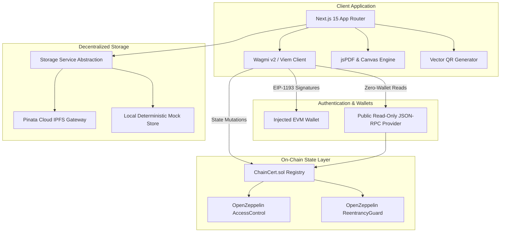
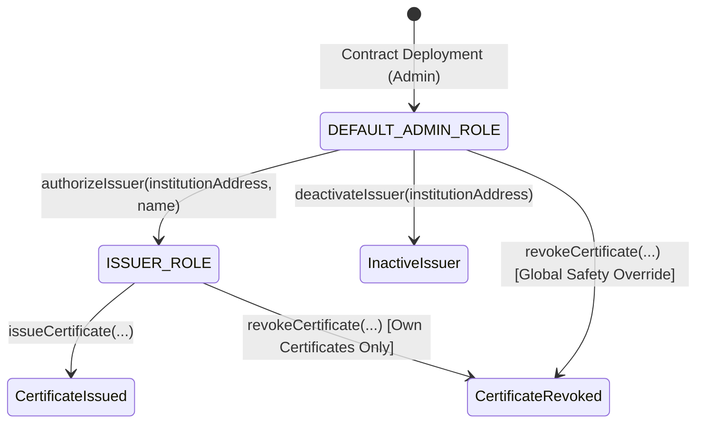
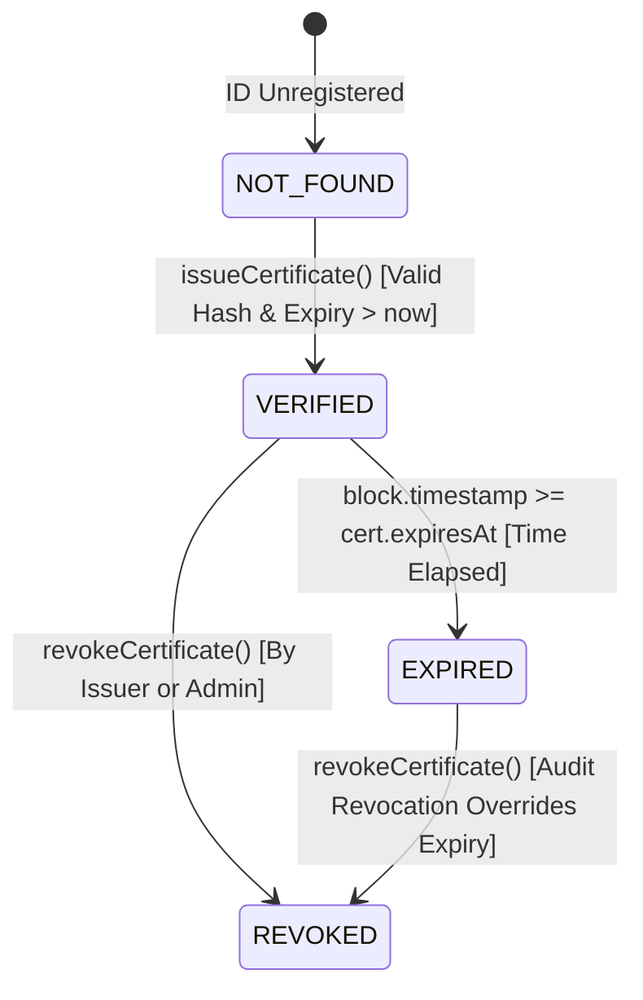
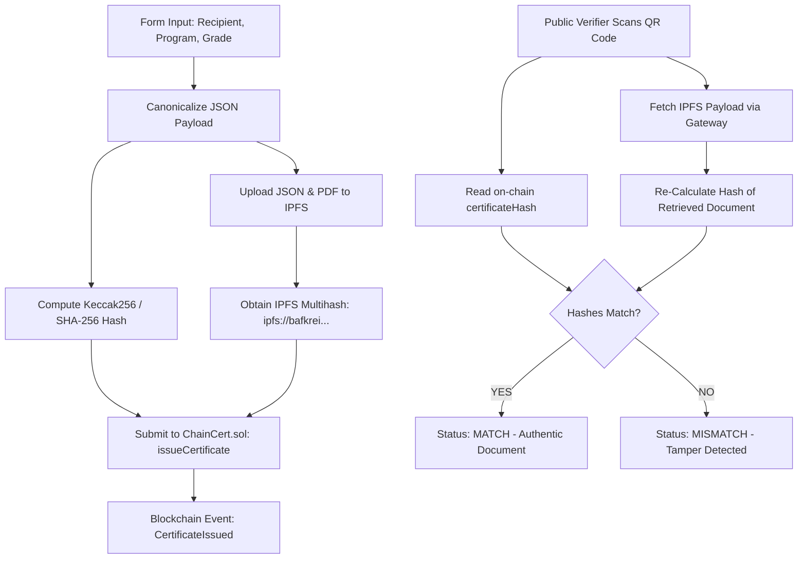
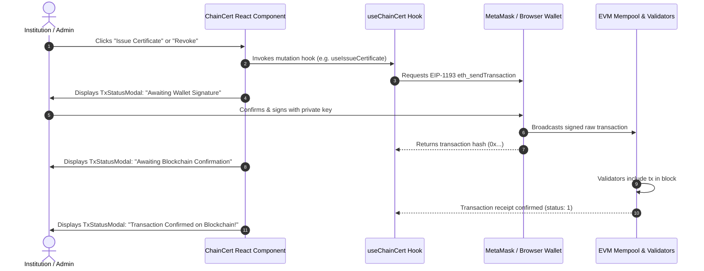

# ChainCert — System Architecture & Technical Specification

**Authors / Engineering Team:** Khaleeq ur Rahman & Shahab  
**Project:** ChainCert Decentralized Credential Verification System  
**Specification Version:** 1.0 (Production Release)  

---

## 1. High-Level System Architecture

ChainCert is structured as a dual-layer Web3 application separating **consensus state** (on-chain) from **rich content payload** (off-chain decentralized storage).



---

## 2. On-Chain Smart Contract Architecture (`ChainCert.sol`)

The `ChainCert.sol` smart contract acts as the single authoritative registry. It implements `IChainCert` and inherits OpenZeppelin's `AccessControl` and `ReentrancyGuard`.

### 2.1 Role-Based Access Control (RBAC)


- **`DEFAULT_ADMIN_ROLE`**: Granted to the deployment address. Has sole privilege to authorize and deactivate issuers. Cannot issue certificates directly unless also granted `ISSUER_ROLE`.
- **`ISSUER_ROLE`**: Granted to accredited universities. Can issue certificates and revoke certificates that match `msg.sender == cert.issuer`.

### 2.2 Certificate State Model
```solidity
struct Certificate {
    string certificateId;      // Unique Alphanumeric ID (3..64 chars)
    address recipient;         // Student recipient EVM wallet
    address issuer;            // Accredited university wallet
    string metadataURI;        // ipfs:// CID URI (1..256 chars)
    bytes32 certificateHash;   // Keccak-256 / SHA-256 digest of metadata
    uint64 issuedAt;           // Unix timestamp of block inclusion
    uint64 expiresAt;          // 0 for lifetime; unix timestamp for expiring
    bool revoked;              // True if revoked by issuer/admin
    uint64 revokedAt;          // Timestamp of revocation block
    string revocationReason;   // Documented audit reason (1..512 chars)
}
```

---

## 3. Certificate Lifecycle State Machine

A certificate progresses through deterministic, verifiable states based on on-chain flags and EVM block timestamps:



### State Resolution Algorithm (`ChainCert.sol::isCertificateValid`)
```solidity
if (!_certificateExists[certificateId]) {
    return (false, Status.NOT_FOUND);
}

Certificate storage cert = _certificates[certificateId];

if (cert.revoked) {
    return (false, Status.REVOKED);
}

if (cert.expiresAt > 0 && block.timestamp >= cert.expiresAt) {
    return (false, Status.EXPIRED);
}

return (true, Status.VERIFIED);
```

---

## 4. IPFS Content Addressing & Integrity Pipeline

To avoid massive gas costs, non-essential data is stored off-chain on IPFS while cryptographic commitments remain on-chain.



---

## 5. Wallet & Transaction Lifecycle

ChainCert implements institutional Web3 transaction UX via `wagmi v2` and `viem`.



---

## 6. Security & Threat Mitigation Summary

| Threat Vector | Severity | Architectural Mitigation |
|---|:---:|---|
| **Reentrancy Attacks** | High | `nonReentrant` modifier applied to all state mutations; state changes precede events. |
| **Unauthorized Issuance** | High | OpenZeppelin `onlyRole(ISSUER_ROLE)` strictly enforced at the EVM bytecode level. |
| **Peer-to-Peer Revocation** | High | `revokeCertificate` enforces `msg.sender == cert.issuer || hasRole(DEFAULT_ADMIN_ROLE, msg.sender)`. Peers cannot revoke other institutions' certificates. |
| **Duplicate ID Collision** | Medium | Mapping `_certificateExists[id]` rejects duplicate issuance with `CertificateAlreadyExists`. |
| **Gas Exhaustion / DoS** | Medium | Bounded lengths on all string inputs (`certificateId` <= 64, `metadataURI` <= 256, `reason` <= 512). |
| **Timestamp Frontrunning** | Low | Strict expiration check `block.timestamp >= cert.expiresAt` eliminates 1-second boundary window. |
| **Malicious File Upload** | High | API `/api/storage/upload` checks `%PDF-` magic header bytes, enforces 10MB limit, and sanitizes filenames. |
| **IPFS Gateway SSRF** | Medium | API `/api/ipfs/[cid]` enforces strict alphanumeric CID regex and blocks path traversal (`..`). |
| **Private Key Exposure** | Critical | Zero server custody. All write operations rely on client-side EIP-1193 wallet signatures. |
