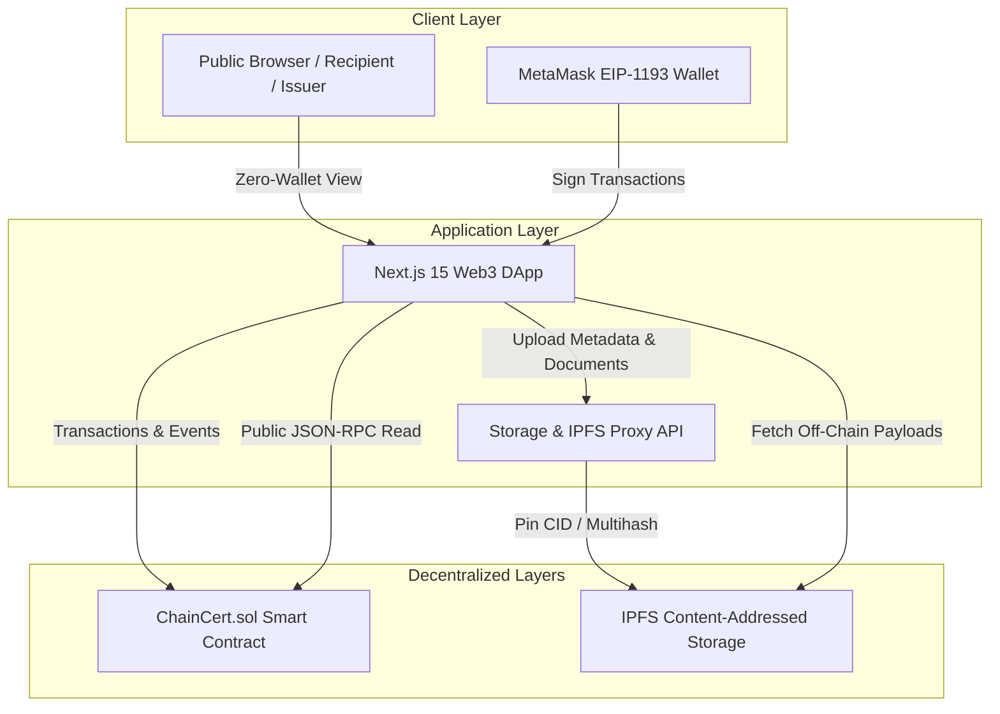
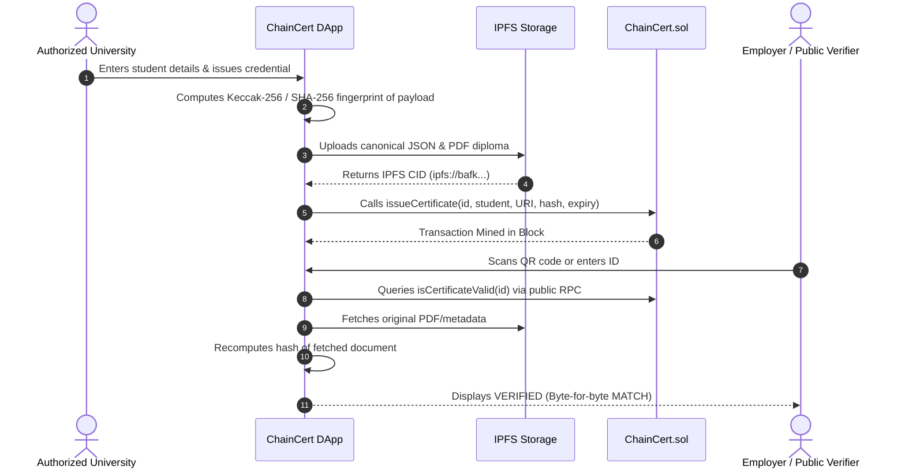

# ChainCert — Capstone Defense Presentation Outline

**Project Title:** ChainCert: Decentralized Credential Issuance & Instant Public Verification Platform  
**Academic Course:** 6-Month Intensive Blockchain & Web3 Engineering Course  
**Engineering Team:** Khaleeq ur Rahman & Shahab  
**Network Status:** Tested and actively running on Local EVM Node (Chain ID: 31337) with Sepolia Testnet readiness (Chain ID: 11155111)  

---

## Slide 1: Title & Executive Summary
- **Title:** ChainCert — Decentralized Credential Issuance & Public Verification
- **Tagline:** *"Verify Credentials. Trust the Blockchain."*
- **Presented by:** Khaleeq ur Rahman & Shahab
- **Core Proposition:** A zero-friction, production-grade Web3 platform enabling accredited institutions to issue tamper-evident academic diplomas anchored to Ethereum smart contracts, with instant zero-wallet public verification for employers.

---

## Slide 2: The Problem
- **The Credential Forgery Crisis:** Widespread availability of graphic editing tools allows fraudulent diplomas and transcripts to be fabricated in minutes.
- **Verification Bottlenecks:** Employers and admissions offices wait 2–6 weeks for university registrars to manually confirm transcripts.
- **Centralized Database Vulnerabilities:** Traditional student databases suffer from single points of failure, administrative tampering, SQL injections, and database migrations.
- **Siloed Systems:** No open, global standard exists for an employer in Tokyo to verify a credential issued in Boston without third-party fees.

---

## Slide 3: The Solution
- **Decentralized Trust:** Replace institutional bureaucracy with decentralized EVM consensus.
- **Minimal On-Chain Footprint:** Store only cryptographic digests, recipient/issuer wallet addresses, issuance timestamps, and revocation flags on-chain.
- **Decentralized Storage (IPFS):** Store high-fidelity transcripts, PDF documents, and rich JSON metadata on IPFS using content-addressed CIDs.
- **Zero-Wallet Verification:** Anyone with an internet browser or mobile camera can scan a QR code and verify authenticity in < 1 second without owning cryptocurrency or installing MetaMask.

---

## Slide 4: Why Blockchain? (Why not a Web2 SQL Database?)
| Dimension | Traditional SQL Database | ChainCert on EVM Blockchain |
|---|---|---|
| **Immutability** | Database admins can edit or delete rows | Cryptographically tamper-proof; cannot alter historical records |
| **Trust Model** | Centralized trust in a server operator | Decentralized consensus across peer nodes (Zero-Trust) |
| **Auditability** | Logs can be disabled or overwritten | Every issuance and revocation is permanently recorded |
| **Availability** | Server downtime breaks verification | Globally accessible 24/7 as long as the blockchain runs |
| **Interoperability** | Proprietary internal APIs | Standard EVM smart contract readable by any Web3 app |

---

## Slide 5: System Architecture & Dual-Layer Storage

- **Separation of Concerns:** 
  - *Blockchain:* Handles permissions, certificate IDs, revocation, and cryptographic hash anchoring.
  - *IPFS:* Handles rich diplomas, courses, syllabi, and student names.

---

## Slide 6: Smart Contract Deep Dive (`ChainCert.sol`)
- **Framework:** Solidity `0.8.28` utilizing OpenZeppelin v5.
- **Role-Based Access Control (RBAC):**
  - `DEFAULT_ADMIN_ROLE`: Platform administration, university accreditation (`authorizeIssuer`, `deactivateIssuer`).
  - `ISSUER_ROLE`: Granted to accredited institutions (`issueCertificate`, `revokeCertificate`).
- **Safety Mechanisms:**
  - `ReentrancyGuard`: Protects against recursive external calls.
  - `Custom Errors`: Saves significant gas compared to string reverts (`CertificateAlreadyExists`, `UnauthorizedRevocation`).
  - Strict Input Boundary Checks: Enforces string bounds on certificate IDs (3..64 chars), metadata URIs (1..256 chars), and institution names (1..128 chars).
  - Anti-Collision Mapping: Prevents ID overwrite.

---

## Slide 7: IPFS & Cryptographic Document Integrity

- **Zero Blind Trust:** ChainCert never claims a document is authentic just because an IPFS link loads. The DApp re-calculates the cryptographic hash and checks for exact equality with the blockchain digest.

---

## Slide 8: Live Demonstration Walkthrough (The 5-Step Evaluation)
1. **Admin Authorizes Institution:** Admin wallet calls `authorizeIssuer(0x..., "Stanford Web3 Institute")`.
2. **Institution Issues Diploma:** Connects university wallet, fills issuance form, and generates verifiable diploma with embedded QR code.
3. **Public Zero-Wallet Verification:** Open `/verify/CC-2026-000001` in an incognito browser without MetaMask. Instant result: **`VERIFIED & AUTHENTIC`**.
4. **Document Integrity & Tamper Test:** Click *"Simulate Tamper"* on the verification page. Observe immediate transition from **`MATCH`** to **`MISMATCH (TAMPER DETECTED)`**.
5. **On-Chain Revocation:** University revokes the credential with an audit reason. Refresh the public verification page: displays **`REVOKED BY ISSUER`** with the on-chain timestamp and documented reason.

---

## Slide 9: Web3 Security Engineering & Audit Results
- **Comprehensive Threat Modeling:** Evaluated against reentrancy, access control bypass, integer flaws, gas griefing, SSRF, and file upload attacks.
- **Remediations Completed:**
  - Bounded input lengths on all Solidity string arguments.
  - Expiration timestamp boundary condition corrected to `timestamp >= expiresAt`.
  - Storage API upload hardened with magic byte inspection (`%PDF-`), payload caps (10MB PDF, 1MB JSON), and path traversal sanitation.
  - IPFS proxy route secured against SSRF and MIME-sniffing with `X-Content-Type-Options: nosniff`.
- **Audit Verification:** 100% test pass on specialized audit test vectors ([`docs/SECURITY_AUDIT_REPORT.md`](./SECURITY_AUDIT_REPORT.md)).

---

## Slide 10: Future Roadmap & Enhancements
- **Zero-Knowledge Proofs (zk-SNARKs):** Allow students to prove GPA $> 3.5$ or graduation without disclosing their name or exact score.
- **Decentralized Identifiers (W3C DID / Verifiable Credentials):** Standardize metadata to W3C VC 2.0 specifications.
- **Multi-Signature University Governance:** Require multi-sig approval (e.g. Dean + Registrar) via Safe contracts before issuing degrees.
- **Layer 2 / Rollup Deployment:** Deploy to Arbitrum or Base for sub-cent transaction fees.

---

## Slide 11: Conclusion & Q&A
- **Summary:** ChainCert successfully delivers an end-to-end, mathematically verifiable credential ecosystem.
- **Engineering Accomplishments:** 39 smart contract unit tests, Next.js 15 production build, and comprehensive security hardening.
- **Authors:** Khaleeq ur Rahman & Shahab
- **Thank you! We are ready for instructor questions.**
